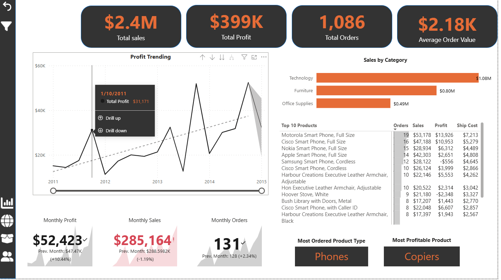
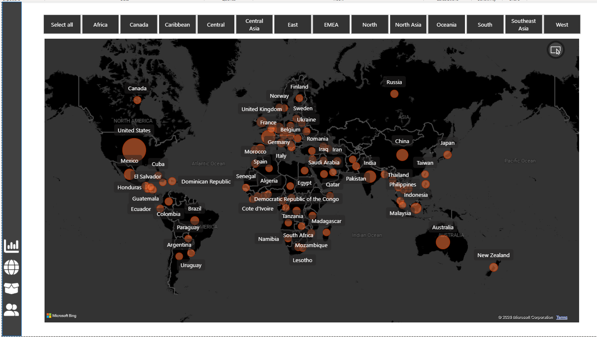
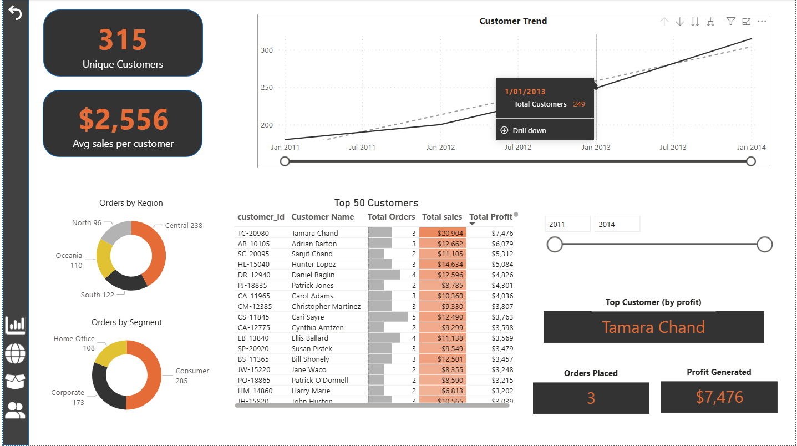
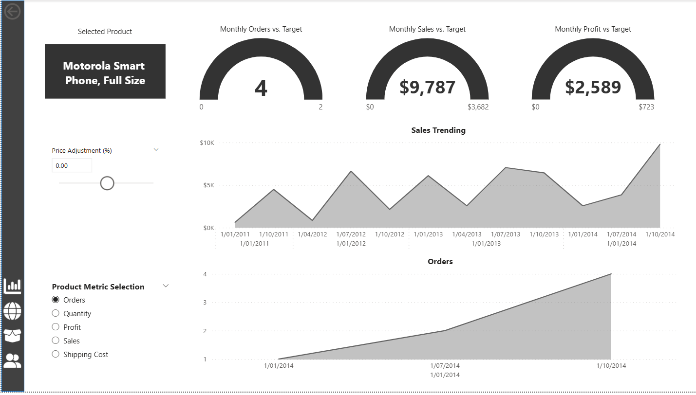
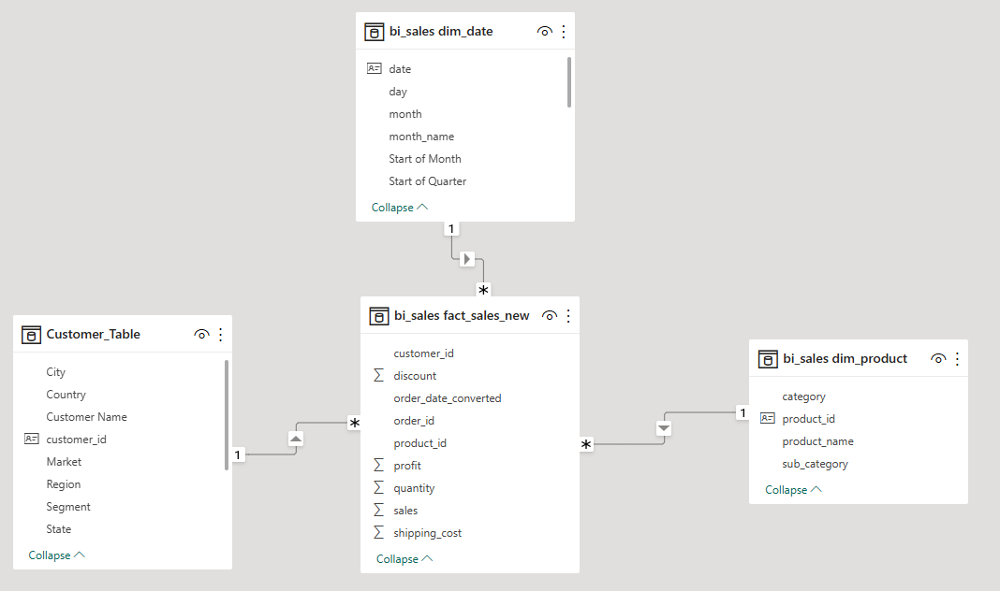

# Sales & Customer Performance Analytics (BI Project)
## Project Overview
This project demonstrates an end-to-end **Business Intelligence analytics solution** built using **MySQL, Power BI, and Python**.
The objective is to transform raw transactional sales data into **actionable business insights** through proper data modelling, SQL transformations, and interactive dashboards.

The project follows real-world BI practices, including:

- Data staging and transformation

- Star schema modelling

- KPI development

- Dashboard storytelling

## Power BI Dashboards

🔹 Page 1 — Executive Overview

🔹 Page 2 — Regional Analysis

- Sales by region

🔹 Page 3 — Customer Analysis

🔹 Page 4 — Product Performance

## Business Objectives

The analysis aims to answer key business questions:

- How is overall sales and profit performance trending over time?

- Which product categories and sub-categories drive the most revenue?

- Who are the most valuable customers?

- How do customer segments and regions contribute to profitability?

- What operational insights can support better decision-making?

  
## Key Insights

- A small group of repeat customers contributes a disproportionately high share of revenue and profit.

- Technology category drives the highest sales, while profitability varies significantly by sub-category.

- Discounts increase sales volume but negatively impact profit margins beyond a threshold.

- Certain regions outperform others despite lower order volume, indicating pricing efficiency differences.

## Dataset

Global Superstore Sales Dataset (A Kaggle Dataset)

Key attributes include:

- Orders and shipping information

- Customer demographics and segments

- Product hierarchy (category / sub-category)

- Sales, profit, discount, and shipping cost

Each record represents a single product line within an order.

### ETL Workflow

Raw CSV Files

↓

Python (Data Cleaning & Validation)

↓

MySQL (Data Modelling & Transformations)

↓

Power BI (Dashboards & Reporting)

## Data Model (Star Schema)

The analytical model follows a star schema design.

## Key SQL Transformations

- Creation of staging (raw) tables

- Conversion of string dates into SQL DATE format

- De-duplication of dimension tables

- Star schema implementation

- KPI aggregation queries

## Tools & Technologies

- SQL: MySQL (data modelling, transformations, KPI queries)

- Python: Pandas, NumPy (data validation)

- BI Tool: Power BI (DAX, data modelling, dashboards)

- Version Control: Git & GitHub

